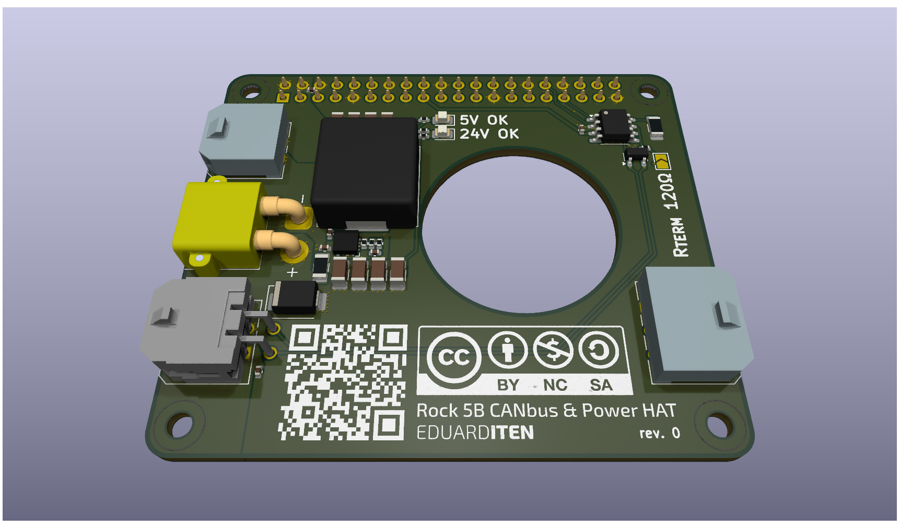

# ROCK 5B High-Power CAN-Bus & Power HAT ("The Beast")



## Über das Projekt

Dieses HAT wurde entwickelt, um den **Radxa Rock 5B** zur ultimativen Steuerzentrale für Hochleistungs-Laserplotter und 3D-Drucker (Klipper) zu machen. Es adressiert die spezifischen Schwachstellen von Standard-Lösungen:

1. **Stabile Stromversorgung:** Liefert massive 5.2V/6A für den SBC und periphere USB-C Touchscreens.  
2. **Native CAN-Performance:** Nutzt den integrierten CAN-Controller des RK3588 statt langsamer SPI-Bridges.  
3. **Thermisches Management:** Ein spezielles "Donut"-Design ermöglicht dem CPU-Lüfter das Ansaugen von Frischluft durch das PCB hindurch.

## Features & Technische Daten

### ⚡ Power Distribution (Split-Path Architektur)

Das Board trennt die Strompfade für maximale Sicherheit und Leistung:

* **Eingang:** 24V DC über verpolungssicheren **XT30 (High Current)** Stecker.  
* **High-Power Pfad (Laser/Toolhead):**  
  * Massive 3-Layer Kupferanbindung.  
  * Direkte Durchleitung von 24V zum Toolhead (bis zu 120W+ möglich, abhängig vom Netzteil).  
  * Geschützt durch **SMBJ24A TVS-Diode** gegen induktive Spannungsspitzen (Back-EMF).  
* **Logik-Pfad (SBC & Display):**  
  * Abgesichert durch **2A Flink** Sicherung (Littelfuse 0466 Serie, 63V Rating).  
  * **DC/DC-Wandler:** TI **TPS56637** Synchron-Buck-Converter.  
  * Ausgang: **5.2V** (kompensiert Spannungsabfall auf Kabeln) bei bis zu **6A**.

### **🚀 Native CAN-Bus**

* Verzicht auf USB-Adapter oder SPI-Chips (MCP2515).  
* Nutzung des nativen **CAN1 Controllers** des RK3588 (Pins 32/33).  
* **Transceiver:** TI SN65HVD230 (3.3V Logic).  
* **ESD-Schutz:** NUP2105L Diode auf den Datenleitungen.  
* **Terminierung:** 120Ω Abschlusswiderstand via Lötjumper (JP1) zuschaltbar.

### 🔌 Poka-Yoke Anschlüsse

Verwendung von **Molex Micro-Fit 3.0** mit unterschiedlichen Polzahlen, um fatale Fehlsteckungen (z.B. 24V auf 5V Eingang) physikalisch zu verhindern.

| Port | Typ | Pins | Beschreibung |
| :---- | :---- | :---- | :---- |
| **24V IN** | **XT30** | 2 | Haupteingang vom Netzteil. |
| **TOOLHEAD** | **Micro-Fit** | 2x2 (4-Pol) | 24V High-Current \+ CAN-Daten zum Laser/Druckkopf. |
| **CONTROLLER** | **Micro-Fit** | 1x3 (3-Pol) | Reine Datenverbindung zum MCU-Mainboard (z.B. Spider). |
| **MONITOR** | **Micro-Fit** | 1x4 (4-Pol) | 2x 5.2V / 2x GND zur Versorgung externer Displays. |

## Pinbelegung (Pinout)

### J102 \- TOOLHEAD (4-Pin Micro-Fit Quadrat)

*Hier wird der Laser oder Druckkopf angeschlossen.*

1. **24V** (Unfused, High Power)  
2. **GND**  
3. **CAN\_L**  
4. **CAN\_H**

### J103 \- SPIDER / MCU (3-Pin Micro-Fit Reihe)

*Verbindung zum Mainboard. Galvanisch getrennt von 24V.*

1. **GND**  
2. **CAN\_L**  
3. **CAN\_H**

### J\_LCD \- MONITOR (4-Pin Micro-Fit Reihe)

*Stromversorgung für USB-C Monitore oder HDMI-Displays.*

1. **\+5.2V**  
2. **\+5.2V**  
3. **GND**  
4. **GND**

## Status LEDs ("Mäusekino")

Das Board verfügt über zwei beschriftete LEDs zur schnellen Diagnose:

* 24V Eingang liegt an (Sicherung intakt).  
* 5.2V Logikspannung stabil (Power Good Signal vom TPS56637).  

## Software Konfiguration (Radxa OS / Armbian)

Da der native CAN-Controller verwendet wird, ist die Einrichtung extrem einfach.

### 1. Overlay aktivieren

Fügen Sie das Overlay für den CAN1-Controller hinzu.  
Via rsetup:  
``Hardware -> Overlays -> Enable CAN1-M1 on GPIO3 (Pins 32/33)``.  
Manuell (``/boot/extlinux/extlinux.conf``):  
Fügen Sie ``rk3588-can1-m1`` zur ``fdtoverlays`` Zeile hinzu.

### 2. Interface konfigurieren

Erstellen Sie ``/etc/network/interfaces.d/can0`` für den Autostart:  
```
allow-hotplug can0 
iface can0 can static  
    bitrate 500000  
    up ip link set $IFACE txqueuelen 1024
```

### 3. Klipper Konfiguration

In der printer.cfg:
```
[mcu]  
canbus_uuid: <deine_uuid>  
# Keine "serial:" Einträge mehr!
```

## Fertigungshinweise (BOM & PCB)

* **PCB Specs:** 4-Layer (Signal / GND / Power / Signal), 1oz Kupfer.  
* **GPIO Header:** Es wird zwingend ein **Stacking Header (Extra Tall, min. 11mm Spacer-Höhe)** benötigt, um Abstand zum CPU-Kühler zu gewinnen.  
* **Löten:** Aufgrund der massiven Masse- und Power-Flächen wird eine Vorheizplatte (Preheater, Druckerheizplatte) oder ein Vorwärmen im Backofen (100°C) dringend empfohlen.

**Kritische Bauteile (LCSC):**

* Buck Converter: **TPS56637RPAR**  
* Induktor: **MDA1350-2R2M** (2.2µH, Isat \> 15A, Shielded)  
* Transceiver: **SN65HVD230**  
* Sicherung: **Littelfuse 0466002.NRHF** (2A, **63V Rating!**)

Disclaimer:  
Dieses Design arbeitet mit hohen Strömen und Spannungen. Nutzung auf eigene Gefahr. Stell sicher, dass Kabelquerschnitte für die Last des Lasers/Hotends ausgelegt sind.